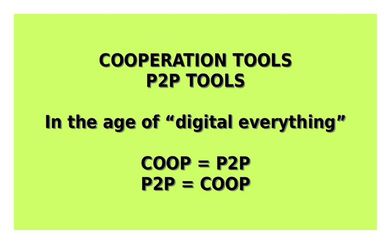

# P2P-is-COOP
**P2P software/Network is the equivalent of COOPERATIVES, for bits!**  
  
P2P software and COOPERATIVE organizations not only share things in common, both are distinct elements of the same idea.  
  
Making both work together can advance each one to high levels that none will be able to achieve if they only work at the level they are today, distinct and separated from each other.  
  
  
  

